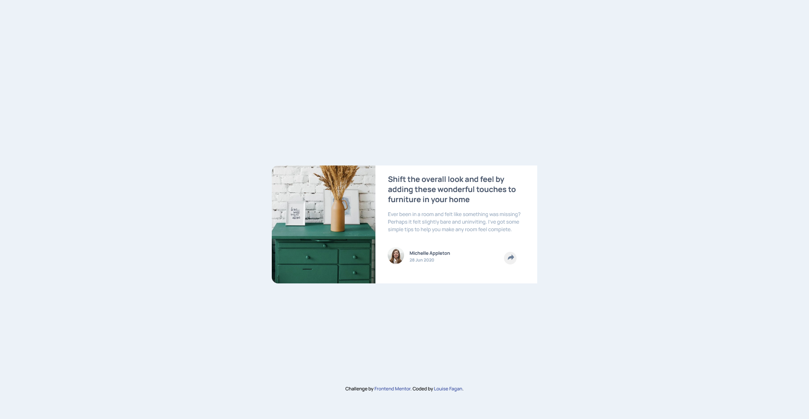

# Frontend Mentor - Article preview component solution

This is a solution to the [Article preview component challenge on Frontend Mentor](https://github.com/LouFagan/Article-Preview-Component.git). Frontend Mentor challenges help you improve your coding skills by building realistic projects.

## Table of contents

- [The challenge](#the-challenge)
- [Screenshot](#screenshot)
- [Links](#links)-
- [Built with](#built-with)
- [What I learned](#what-i-learned)
- [Continued development](#continued-development) -
- [Author](#author)

### The challenge

Users should be able to:

- View the optimal layout for the component depending on their device's screen size
- See the social media share links when they click the share icon

### Screenshot

### Links

- Solution URL: [Add solution URL here](https://github.com/LouFagan/Article-Preview-Component)
- Live Site URL: [Add live site URL here](https://loufagan.github.io/Article-Preview-Component/)

### Built with

- Semantic HTML5 markup
- CSS custom properties
- Flexbox
- Mobile-first workflow
- SASS
- GULP

### What I learned

I learned how to make a triangle with css and position it under a component. I also learned a different way of setting up a project using gulp and sass. I deepened my learning about mixins and used the new @forward and @use to link all my scss.

### Continued development

I definitely want to continue learning javascript, SASS and all that has to do with front end development.

## Author

- Website - [Louise Fagan](https://www.pixelmein.ca)
- Frontend Mentor - [@LouFagan](https://www.frontendmentor.io/profile/LouFagan)
